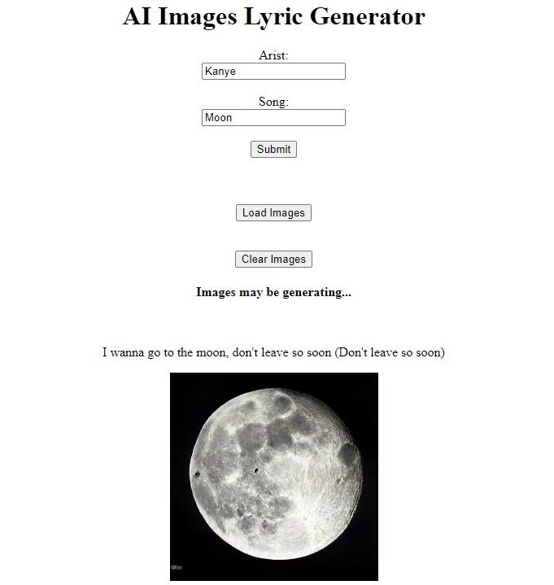
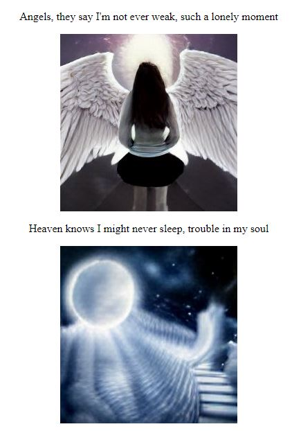

# AI-Image-Lyrics
Locally hosted Flask web-app. Users enter an artist and song title and receive AI generated images corresponding to each line of the chosen song's lyrics.

   </img>    

   </img>

